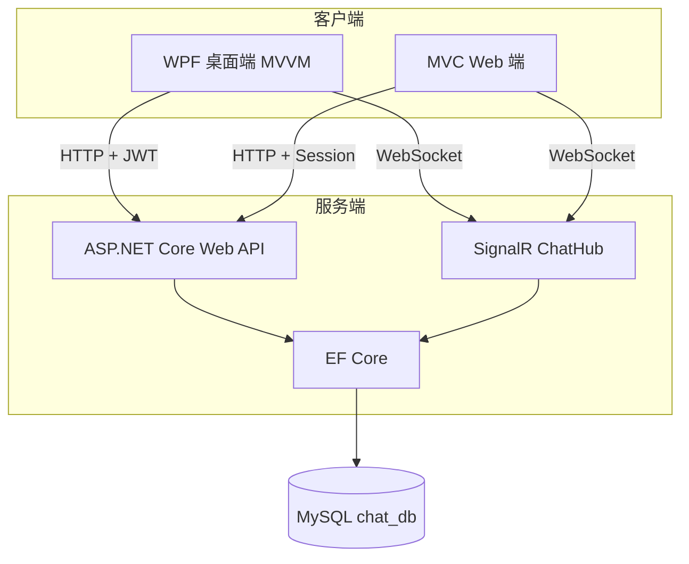
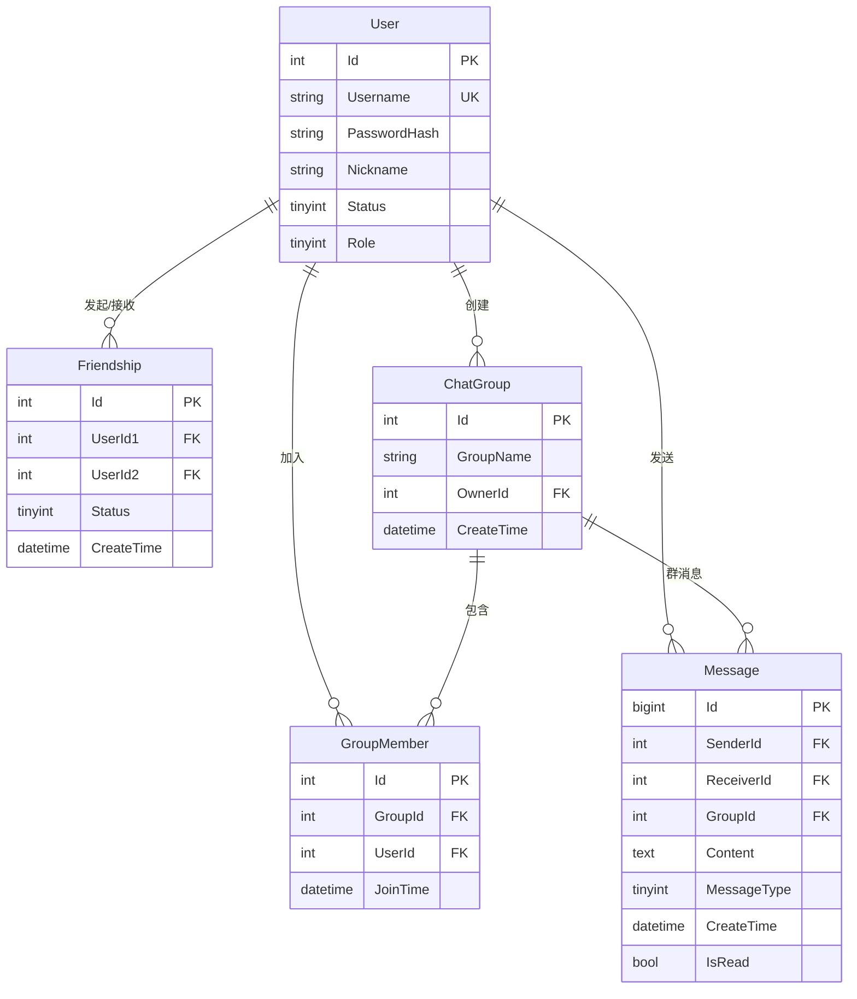
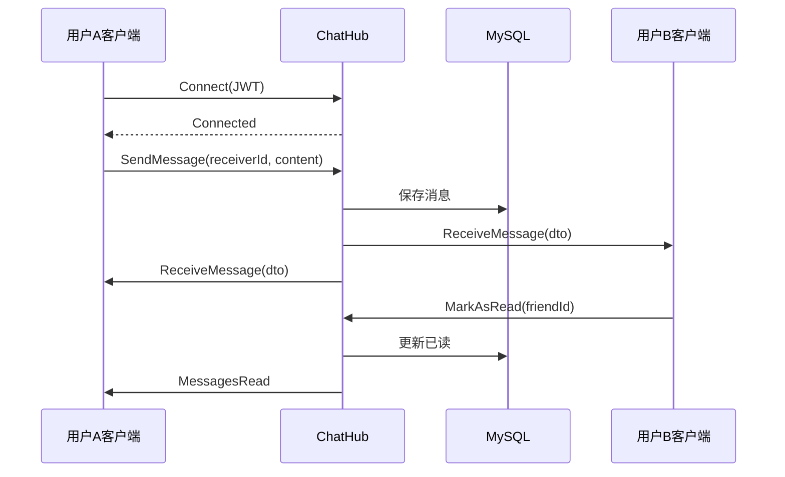

# 网上沟通交流系统 — 设计报告

## 1. 项目概述

本系统是一个类似 QQ 的网上沟通交流管理系统，满足现代软件开发技术实践课程考核要求。系统支持管理员后台管理、一般用户 Web 端与 WPF 桌面端双端聊天，采用前后端分离架构，通过 SignalR 实现实时双向通信。

## 2. 需求分析

### 2.1 功能性需求

| 角色 | 功能 |
|------|------|
| 管理员 | 注册审批、账号禁用/解禁、交流信息查询与删除 |
| 一般用户 | 注册登录、好友管理、群聊、实时会话、文件传输、历史记录管理 |

### 2.2 非功能性需求

- 密码 BCrypt 加盐哈希存储
- 界面动态更新、无闪烁感
- 网络断开自动重连
- 数据持久化至 MySQL

## 3. 系统架构

## 4. 数据库设计

### 4.1 E-R 关系

### 4.2 表说明

- **User**：用户账号，Status(0待审批/1正常/2禁用)，Role(0用户/1管理员)
- **Friendship**：好友关系，UserId1 为发起人，Status(0申请中/1已是好友)
- **Group**：群组，OwnerId 为群主
- **GroupMember**：群成员
- **Message**：消息记录，私聊填 ReceiverId，群聊填 GroupId

## 5. 实时通信时序（SignalR）

## 6. 模块设计

### 6.1 后端 API

| 控制器 | 职责 |
|--------|------|
| AuthController | 注册、登录、JWT 签发 |
| FriendsController | 好友搜索、申请、同意、删除 |
| GroupsController | 群组 CRUD、邀请、踢人 |
| MessagesController | 历史查询、删除、清空 |
| AdminController | 用户审批、禁用、消息管理 |
| FilesController | 文件上传 |

### 6.2 WPF 桌面端（MVVM）

- **LoginViewModel**：登录/注册
- **MainViewModel**：好友列表、聊天、群组、SignalR 事件处理
- **ApiService**：HTTP 请求封装
- **ChatHubService**：SignalR 连接与事件

### 6.3 Web 端（MVC）

- **AccountController**：登录注册
- **ChatController**：聊天页面与 AJAX 代理
- **AdminController**：管理后台

## 7. 安全设计

- 密码使用 BCrypt 哈希，禁止明文存储
- API 使用 JWT Bearer 认证
- 管理员接口 `[Authorize(Roles = Admin)]`
- SignalR 通过 QueryString 传递 access_token

## 8. 开发与测试

### 8.1 开发分工（双人组参考）

| 成员 | 职责 |
|------|------|
| 同学 A | 后端 API + SignalR + Web 端 |
| 同学 B | WPF 桌面端 + UI 交互 |

### 8.2 测试用例

1. 注册 → 管理员审批 → 登录
2. 添加好友 → 同意 → 私聊
3. 创建群 → 群聊
4. Web 与 WPF 跨端互发消息
5. 上传图片/文件
6. 管理员删除消息、禁用用户

## 9. 总结

本系统完整实现了考核要求的全部基本功能与进阶功能（群聊、文件传输、实时无闪烁、在线状态），采用现代 .NET 技术栈，架构清晰、代码可维护，适合现场演示与答辩。
